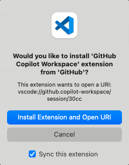

# GitHub Copilot Workspace VS Code extension

This Copilot Workspace VS Code extension allows you to use GitHub Copilot Workspace from the comfort of VS Code. Continue an existing session and edit and debug the proposed changes before creating a PR. Whether you use natural language to revise the plan or implementation, or edit files directly, you can use the full power of VS Code and its extension ecosystem all while syncing your edits to GitHub Copilot Workspace on the web.

This is currently an alpha extension and we will be rolling out enhancements to the extension in multiple phases.

1. **Continue on:** Browse your Copilot Workspace sessions and sync changes so you can edit and debug your application in VS Code locally, using one of the other [VS Code Remote extensions](https://marketplace.visualstudio.com/items?itemName=ms-vscode-remote.vscode-remote-extensionpack), or in your own [Codespace](https://github.com/features/codespaces).

2. **[IN-PROGRESS] Update your workspace using AI**:

    - **Available:** Natural language revisions to the plan and files in the plan.
    - **Planned**: Support for editing / adding information to the task, specification, and brainstorming, plus integration into chat.

3. **[FUTURE] Create new:** While not available now, you'll be able to create a new Copilot Workspace session in VS Code.

## Getting started

* [Quick Start](#quick-start)
* [Browsing Sessions](#browsing-sessions)
* [Resuming and Syncing](#resuming-sessions)
* [Planing and Implementing](#plan-and-implement)
* [Natural Language Revisions](#resuming-sessions)
* [Known Limitations](#known-limitations)

### Quick Start

1. If you haven't already, install [Visual Studio Code](https://code.visualstudio.com/).

1. Next, open a session [on the web](https://copilot-workspace.githubnext.com) that you'd like to continue working on in VS Code.

1. Click on the `VS Code` button in the session screen.

    

1. Allow your browser to open the link in VS Code when prompted.

1. VS Code will open (if it isn't already running), and you'll be prompted to install the Copilot Workspace extension and then open the URI. If the extension is already installed, you'll just be asked about the URI. Either way, open the URI.

   

1. **[One time]** If you haven't signed in already, you'll be prompted to do so. Click the `Sign in` and complete the sign in process in the browser that opens.

If you picked a session that doesn't yet have an implementation, you can create one and you'll be presented with the opportunity to sync it locally later. Read on for more! 😎

## Browsing Sessions

You can browse your active CW sessions, by clicking on a session in the `Sessions` list. This will open up two views, which allow you to see the details of the `Task` and `Plan` for the session. Additionally, you can view the contents of implemented files, clicking on file in the `Plan` view or the "versions" icon that appears on hover.

   
   
When you're done viewing a session, you can click the `Back to sessions list` arrow in the `Task` view, which brings you back to the list of your sessions.

## Resuming and Syncing

If you'd like to actually resume a session in VS Code and sync it to your filesystem for changes, then simply click the sync icon for the session, in either the `Sessions` list, or the `Task` view (if you clicked into a session). When you click this, VS Code will prompt you to either clone or open a copy of the associated repo. Or, if you resume a session for the already opened repo, then CW will simply stash any active changes and then open a new branch.

Once you've got the repo/branch open, the changes from the selected session will be synced down to your local machine, and from here, you can begin editing/debugging/running the code as usual. Additionally, as you edit code, those changes will be synced back up to the CW service. This allows you to resume your work later, from either the web client, or the mobile PWA.

Once you're done with a session, click the sync button again in the `Task` view, which will stop the file syncer and move you back to the main branch of the repo. 

